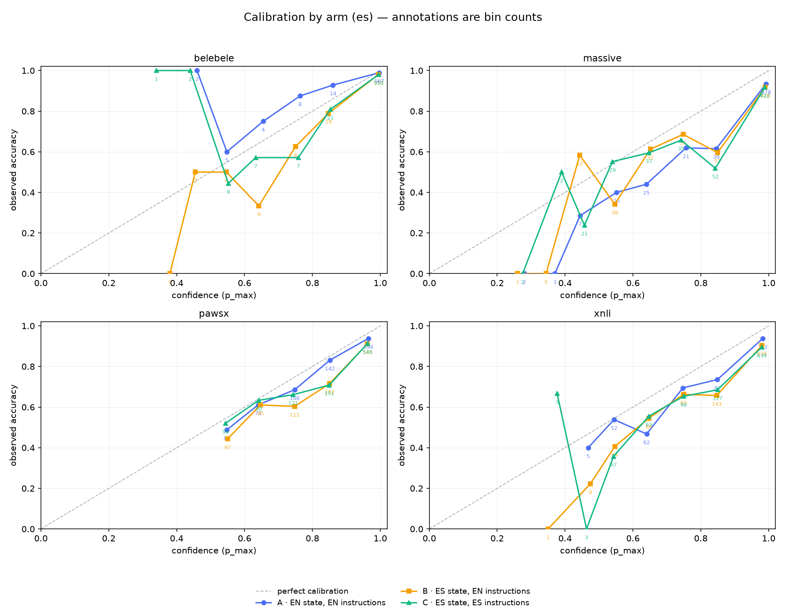
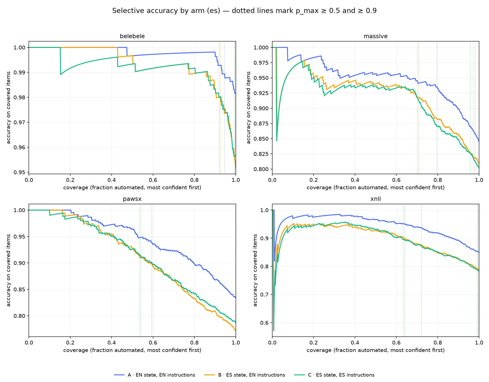

# jev-acento

**¿Jev entiende tu acento?**

Auditoría independiente y reproducible de [Jev](https://typesafe.ai) —el modelo "System One" de
TypeSafe AI— en **español**, más una herramienta de línea de comandos para que cualquiera corra
la misma comparación sobre sus propios datos etiquetados.

**Corrida `20260921-es-v1`** — 19.200 llamadas, 3.200 ítems pareados, modelo `jev-1.13.0`
(versión fijada), USD 0,58, cero errores. Todos los números de abajo salen de
[`results.json`](results.json) vía `make reproduce`; ninguno se escribió a mano.

## Hallazgos

**1. El español cuesta accuracy en los cuatro datasets.** Manteniendo las instrucciones en
inglés y cambiando solo el `state` de inglés a español (B − A), Jev es mediblemente peor en
todos:

| Dataset | A (state EN) | B (state ES) | Δ accuracy | Veredicto |
|---|---|---|---|---|
| XNLI | 0,850 | 0,786 | −6,4 pp `[−8,6, −4,3]` | **mediblemente peor** |
| PAWS-X | 0,834 | 0,772 | −6,2 pp `[−8,5, −3,6]` | **mediblemente peor** |
| MASSIVE | 0,845 | 0,808 | −3,7 pp `[−5,8, −1,5]` | **mediblemente peor** |
| Belebele | 0,982 | 0,952 | −3,0 pp `[−4,5, −1,7]` | **mediblemente peor** |

**2. También cuesta calibración, en las dos tareas más difíciles.** El ECE se duplica en XNLI
(0,057 → 0,101) y PAWS-X (0,033 → 0,078) — *menos calibrado* según la regla pre-registrada. En
MASSIVE y Belebele el cambio no es detectable. Acá la calibración importa más que la accuracy:
la consecuencia operativa es que automatizar con `p_max ≥ 0,9` cubre **72,2% de XNLI en inglés
pero solo 63,4% en español**, y los ítems que sí automatizás son *menos* precisos
(0,938 → 0,904), no más.

**3. Escribir las instrucciones en español no ayuda.** Es la pregunta que nadie había medido, y
la respuesta es un nulo limpio en tres de los cuatro datasets (C − B):

| Dataset | Δ accuracy | Veredicto |
|---|---|---|
| XNLI | −0,2 pp `[−1,1, +0,7]` | sin diferencia detectable |
| MASSIVE | −0,7 pp `[−1,8, +0,7]` | sin diferencia detectable |
| Belebele | +0,5 pp `[+0,0, +1,2]` | sin diferencia detectable |
| PAWS-X | +1,6 pp `[+0,7, +2,6]` | ambiguo — real pero por debajo del umbral de 3 pp |

En calibración no hay diferencia detectable en ninguno. **Recomendación práctica: dejá las
`instructions` y los `criteria` en inglés.** Nunca es peor, es lo que el proveedor documenta
como su punto fuerte, y en MASSIVE la redacción en español cuesta 6,2% más tokens de input a
cambio de nada.

**4. El texto en español cuesta entre 17% y 38% más tokens de input** que el mismo contenido en
inglés (state-only, restando el overhead fijo de la pregunta). Mucho menos que el ~3× que la
auditoría rusa encontró para el cirílico.

### Comparación con la auditoría rusa

| | Ruso (trabajo previo) | Español (este repo) |
|---|---|---|
| Accuracy XNLI | 88,3% → 77,3% (−11,0 pp) | 85,0% → 78,6% (−6,4 pp) |
| ECE XNLI | 0,032 → 0,096 | 0,057 → 0,101 |
| Ratio de tokens | ~3× | ~1,23× |

El español se degrada menos que el ruso, que es lo esperable de un idioma en alfabeto latino más
cercano a la distribución de entrenamiento. La dirección es la misma; la magnitud, alrededor de
la mitad.

### ¿El modelo fue lo bastante estable como para confiar en esto?

Sí, y se verificó **antes** de interpretar nada de lo de arriba. Las pasadas 0 y 1 mandaron
requests byte a byte idénticos: tasa de flips 0,2–2,1%, κ de Cohen ≥ 0,95, y **jitter de accuracy
entre pasadas de 0,000–0,005 contra deltas de 0,030–0,064**. El ruido propio del modelo es un
orden de magnitud menor que los efectos reportados.

Tablas completas, bins de confiabilidad, curvas de accuracy selectiva y cobertura por brazo en
[`results.md`](results.md). Desviaciones del pre-registro: [`DEVIATIONS.md`](DEVIATIONS.md)
(no hubo ninguna).

## Las preguntas

Jev no genera texto. Recibe un `state` y preguntas tipadas (Choice, Score, Noul) y devuelve
respuestas **con probabilidades**. Toda su propuesta de valor es que esas probabilidades estén
*calibradas*, para que el software automatice por encima de un umbral y derive el resto a una
persona.

TypeSafe dice que el inglés es el idioma principal y que los demás se manejan "pero no igual de
bien", sin publicar números. Este repo mide tres cosas:

1. **Costo del idioma.** Con instrucciones en inglés, ¿Jev pierde accuracy y calibración cuando
   el `state` está en español, sobre los mismos ítems etiquetados por humanos?
2. **Idioma de las instrucciones.** Con `state` en español, ¿conviene escribir `instructions` y
   `criteria` en inglés o en español?
3. **Costo operativo.** Ratio de tokens ES/EN, latencia p50/p95, y cobertura automatizable a los
   umbrales típicos (0,5 y 0,9).

**La pregunta 2 es el aporte original.** Es la decisión práctica que tiene que tomar cualquier
equipo hispanohablante, y nadie la midió.

## Diseño

Diseño pareado: los mismos ítems en cada brazo.

| Brazo | `state` | `instructions` + `criteria` |
|-------|---------|------------------------------|
| A | inglés | inglés |
| B | español | inglés |
| C | español | español |

Las claves de opción (`entailment`, `alarm_set`, `option_1`…) quedan en inglés e idénticas en los
tres brazos. El brazo C traduce solamente las `instructions` y las descripciones de `criteria`.
Eso es lo que aísla el efecto del idioma de las instrucciones del efecto del espacio de etiquetas.

Comparaciones primarias pre-registradas: **B − A** (comparable con la
[auditoría rusa](https://github.com/AHTOOOXA/jev-cyrillic-audit)) y **C − B** (nueva).

### Figuras



*Confianza contra accuracy observada, los tres brazos sobre los mismos ítems. Las
anotaciones son conteos por bin — los bins de baja confianza tienen unidades y no hay que
leerlos como tendencia. En XNLI y PAWS-X los brazos en español caen visiblemente por debajo
de la diagonal: sobreconfianza.*



*Accuracy contra cobertura, de mayor a menor confianza. Es la vista operativa: cuánto podés
automatizar, y qué tan preciso es lo que automatizás. Las líneas punteadas marcan la
cobertura alcanzada con `p_max ≥ 0,5` y `≥ 0,9`.*

## Datasets

Solo públicos, paralelos y con etiquetas humanas. **No se redistribuye el texto fuente**: este
repo commitea únicamente ids, etiquetas gold y hashes del state; el texto se recupera
re-joineando contra el dataset original.

| Dataset | id en HF | Primitiva | n | Notas |
|---------|----------|-----------|---|-------|
| XNLI | `facebook/xnli` | Choice, 3 opciones | 1000 | Traducción humana |
| PAWS-X | `google-research-datasets/paws-x` | Noul | 1000 | Única cobertura de Noul en v0.1 |
| MASSIVE intent | `mteb/amazon_massive_intent` | Choice, 59 intents | 600 | es-ES, no rioplatense |
| Belebele | `facebook/belebele` | Choice, 4 opciones | 600 | Techo del dataset (900 filas) |

## Por qué solo español

El alcance original incluía portugués. La v0.1 sale solo en español por dos motivos:

1. **Dos de los cuatro datasets no tienen portugués.** XNLI cubre 15 idiomas y PAWS-X cubre 7;
   ninguno incluye `pt`. El portugués existía solo en MASSIVE (como `pt-PT`, no `pt-BR`) y en
   Belebele: la mitad de la evidencia, y la mitad más débil.
2. **No hubo revisor nativo disponible.** Este repo no congela un prompt que no revisó un
   hablante nativo. Correr portugués sin esa revisión habría producido un número indefendible.

El portugués queda como **trabajo futuro**, y es barato de agregar: el brazo A (state en inglés)
se comparte entre idiomas, así que una v0.2 solo necesita los brazos B y C sobre MASSIVE y
Belebele.

## Dos caminos de acceso

```bash
acento run --provider typesafe    # directo; fija la versión del modelo
acento run --provider gateway     # Gateway de Vercel; sin waitlist
```

Los dos hablan exactamente el mismo formato nativo. Para la auditoría conviene el directo, porque
es el único que informa qué versión del modelo respondió. El camino por Gateway se mantiene para
que el trabajo sea reproducible sin una cuenta aprobada de TypeSafe. Comparación completa en
[`docs/providers.md`](docs/providers.md).

## Usarlo con tus propios datos

La auditoría es un uso del harness. El otro es comparar **tus** redacciones de preguntas sobre
**tus** datos etiquetados:

```bash
acento compare --data mis_tickets.jsonl \
               --questions q.en.json q.es.json \
               --out reporte/
```

- `--data`: JSONL con `id`, `state` y `gold` por pregunta. **No hace falta tener datos paralelos
  en inglés.**
- `--questions`: dos o más versiones del mismo set de preguntas —mismas claves, distinto idioma o
  redacción. Cada versión corre sobre los mismos ítems.
- Salida: `reporte/results.md`, `results.json` y figuras, con deltas pareados de accuracy, ECE
  contra un piso de ruido, cobertura a umbral y tokens.

De tu máquina no sale nada salvo las llamadas a Jev.

Hay un dataset sintético de ejemplo en `examples/`, y funciona con la API falsa sin ninguna key:

```bash
acento compare --data examples/tickets.jsonl \
               --questions examples/q.en.json examples/q.es.json \
               --out /tmp/demo --dry-run
```

## Reproducir la auditoría

El pre-registro **todavía no está congelado**: `PREREG.md` es un borrador a la espera de la
revisión de las redacciones en español. Hasta que se corra `make freeze` y se commiteen sus
manifiestos, `make check-prereg` reporta correctamente que no hay nada registrado, y `make run`
se niega a escribir en `runs/`.

```bash
acento smoke --provider typesafe   # verificar un proveedor antes de confiarle una corrida
make check-prereg   # verificar que los prompts y el pre-registro siguen hasheando igual
make test           # métricas sobre datos sintéticos, runner contra la API falsa, freeze
make dry-run        # pipeline completo, sin red y sin gasto
make run            # la corrida real (~19k llamadas, ~USD 0,50, ~35 min)
make reproduce      # regenerar results.* y figures/ de forma determinística desde runs/
make verify         # el gate completo: freeze, tests, scan de secretos, reproducibilidad
```

## Limitaciones

- **Una sola redacción por celda.** Cada celda usa una redacción única, que es una muestra de
  tamaño 1 del espacio de redacciones posibles. El nulo de C − B significa que *estas dos
  redacciones* rindieron igual, no que las instrucciones en español y en inglés sean
  intercambiables en general. Es la amenaza más grande a la validez del hallazgo 3, y por eso
  está acá arriba y no escondida.
- **MASSIVE es es-ES**, Belebele y XNLI son traducciones, y nada de esto es rioplatense ni
  ninguna otra variedad regional. Un equipo que escribe para usuarios argentinos o mexicanos
  debería tomar estos números como cota superior de lo que le va a rendir su propio texto.
- **Score no está cubierto.** No existe un dataset ordinal paralelo adecuado, así que solo se
  midieron Choice y Noul. Nada acá dice nada sobre Score.
- **Cuatro benchmarks académicos no son tu workload.** XNLI, PAWS-X, MASSIVE y Belebele son
  limpios, cortos y balanceados; tus tickets no. Usá `acento compare` sobre tus propios datos
  etiquetados en vez de asumir que estos deltas se transfieren.
- **Fijar la versión del modelo depende del proveedor.** **Esta corrida quedó anclada:** las
  19.200 filas reportan `jev-1.13.0`, verificado desde los datos y no asumido. Por la API **directa** de TypeSafe,
  cada fila registra la versión que respondió (`jev-1.13.0`) y la corrida queda anclada. Por el
  **Gateway de Vercel** no: rechaza ids versionados (`typesafe-ai/jev-1.13.0` → 404) y devuelve
  el alias `typesafe-ai/jev`, así que un cambio silencioso de modelo a mitad de corrida solo se
  puede detectar, no descartar. Ver [`docs/providers.md`](docs/providers.md).
- **Una sola corrida.** La estabilidad se midió *dentro* de esta corrida (dos pasadas, con ~20
  minutos de diferencia). Nada acá acota cuánto se mueve el comportamiento de Jev en español
  entre versiones del modelo.

## Cómo se construyó esto

El diseño, el alcance y cada decisión metodológica son míos. Buena parte del código se escribió
con un agente de programación.

Lo digo de entrada en vez de dejar que se descubra — y es también la razón por la que este repo
se apoya en cosas que no requieren confiar en su autor: un pre-registro congelado por hash antes
de la primera llamada real, con un runner que se niega a escribir resultados si cambia; el ECE
reportado contra un piso de ruido simulado y no en el aire; un gate de estabilidad verificado
antes de interpretar cualquier resultado; y `make verify`, que regenera cada número publicado y
las dos figuras byte a byte desde las filas crudas commiteadas, sin acceso a la red.

Verificá las afirmaciones, no la autoría.

## Licencia

MIT, tanto para el código como para las filas derivadas en `runs/`. Ver
[`THIRD_PARTY.md`](THIRD_PARTY.md) para las licencias de los datasets y el crédito al trabajo
previo.
